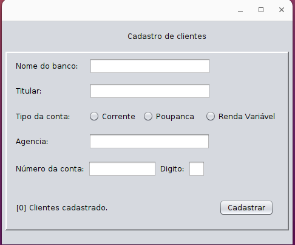
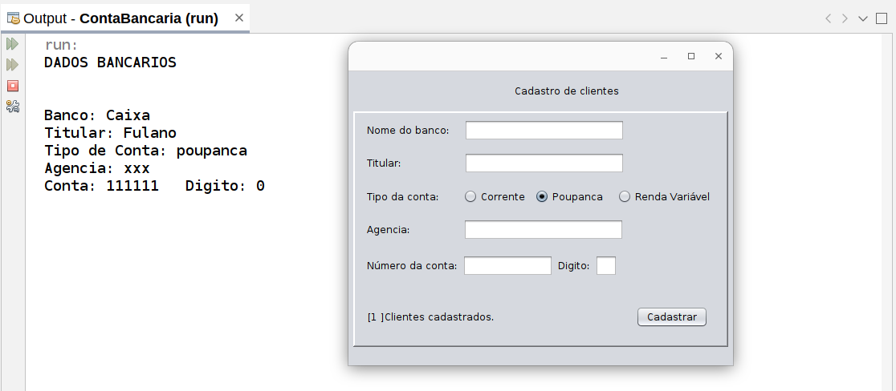
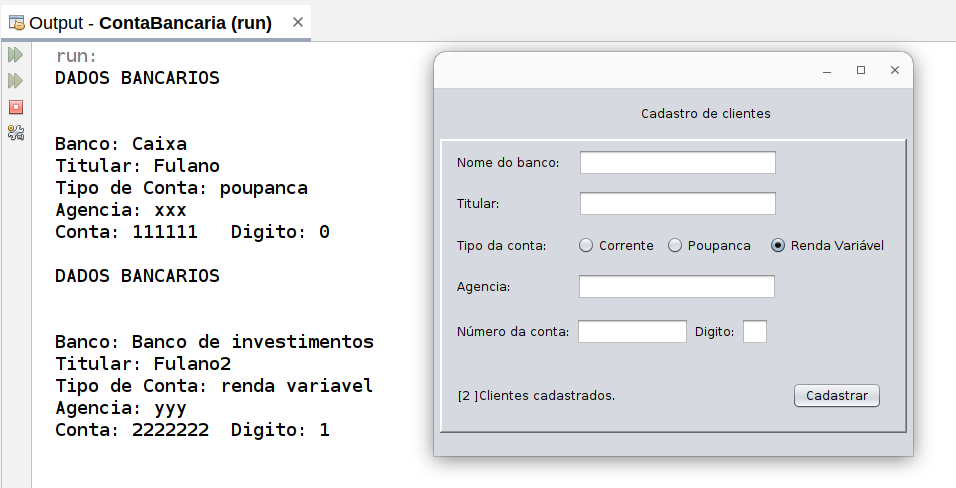
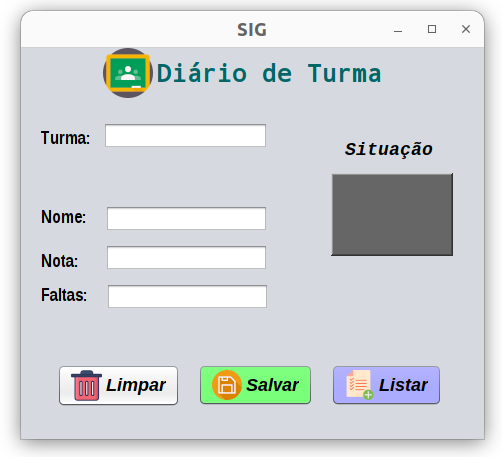
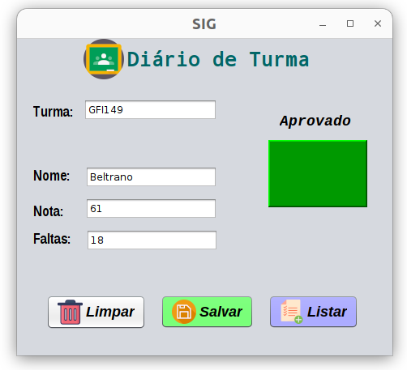
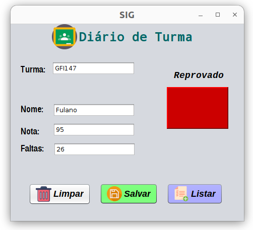

# Java

<figure></figure>
    <h1>Iniciativa de projetos</h1>

    <ul>
        <li>ContaBancaria</li>
        

        <h3><a href="https://github.com/Sousa-Diin/Java/tree/main/ContaBancaria/src/contabancaria">Código fonte acesse aqui</a></h3>
            
            
            
    

        <li>DateStructsType</li>
        <li>ProjectFx</li>
        <li>ExersiseAtClass
           <ul>
              <li>Fila</li>
              <li>Lista</li>
              <li>Pilha</li>
           </ul>
        </li>
    </ul>
<<<<<<< HEAD

    

        
        
        
=======
    

    <h3><a href="https://github.com/Sousa-Diin/Java/tree/main/ExerciciosAula/src/lista">Código fonte acesse aqui</a></h3>
        
        
        
>>>>>>> 5e964310d8d0546d90d6c36a551336870427f71b
    

    <table>
    </table>

